# PTC Quality Control Procedure (Beginner-Friendly)

Version: v1.1 beginner rewrite  
Based on: `PTC_QC_Procedures_v1.1.pdf`  
Audience: First-time tester with no Linux command-line experience

---

## 1) Before You Start

This guide explains exactly how to test a PTC board from start to finish.

If you are new to Linux or lab test work, do not worry. Every command and action is written step by step.

### What this procedure does

You will:
- inspect delivered parts
- set up the QC test station
- run manual tests
- run script-based tests
- complete mechanical assembly
- record PASS/FAIL in HWDB

### Safety and handling rules (always apply)

- Wear PPE: long pants, long sleeves, closed-toe shoes, ESD-safe gloves, antistatic wrist strap.
- Handle boards only at edges.
- Never force connectors, SD cards, or modules.
- Turn power **off** before connecting/disconnecting cables unless a step explicitly says otherwise.
- If expected behavior is missing (LEDs, current draw, boot messages), stop and ask a UPenn electronics engineer.

**PPE (reference photo from the official v1.1 procedure):**

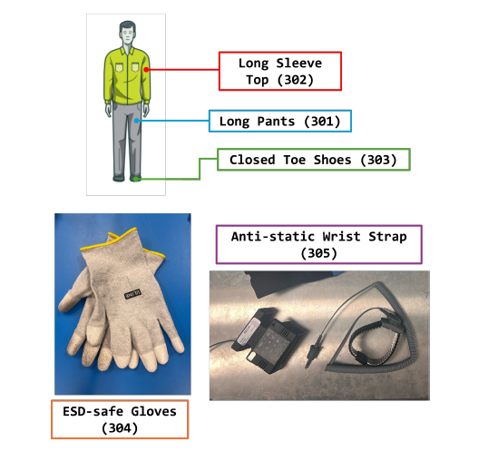

---

## 2) Quick Vocabulary (Plain Language)

- **DUT**: Device Under Test (the PTC board you are testing)
- **QC board**: the test fixture board used to test DUT
- **SoM**: System on Module (Enclustra module installed on DUT)
- **HWDB**: hardware database where serial numbers and pass/fail results are recorded
- **LED**: small indicator light on the board/front panel
- **DVM**: digital volt meter
- **SFP**: optical transceiver module used for fiber links
- **EtherCAT / GbE / timing**: communication interfaces used by the DUT
- **SSH**: remote terminal login to another machine
- **Serial terminal**: direct text connection to board through USB serial

---

## 3) Linux Basics You Need for This Procedure

You only need a few commands.

### Open a terminal

On the Linux machine, open Terminal.

### Commands used in this guide

- `cd <folder>`: move to a folder
- `ls`: list files in current folder
- `pwd`: show current folder
- `ping <ip-address>`: test network communication
- `ssh root@<ip-address>`: connect to board over network
- `exit`: disconnect from SSH session

### How to run commands safely

- Copy/paste commands exactly.
- Press Enter after each command.
- Wait for output before moving to the next command.
- If command says "permission denied", ask lab lead before using `sudo`.

---

## 4) Equipment Checklist

Confirm all items are present before testing:

- Visual inspection tools: camera, microscope, barcode/QR scanner
- QC station hardware: QC board, power supplies (24V and 48V), oscilloscope, DVM
- Network hardware: switch, media converters, Ethernet cables, SFP modules, fibers
- Computers: Linux machine and Windows machine
- Programming tools: SD writer, Infineon XMC Link
- PPE: required ESD-safe attire and wrist strap

If anything is missing, do not start the test.

Reference (same model as in the official procedure): [Tera D6100 2D wireless barcode scanner with stand](https://tera-digital.com/products/d6100-2d-wireless-barcode-scanner-with-stand).

**Visual inspection tools (reference photos from the official v1.1 procedure):**

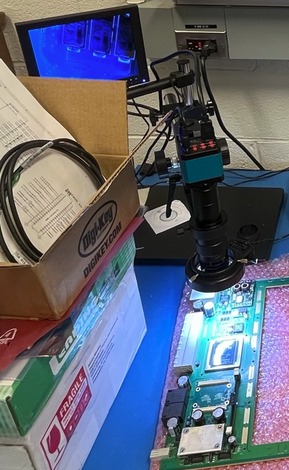

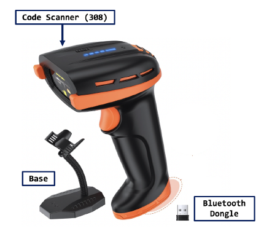

*(Other figures from the PDF are placed inline in the sections below.)*

---

## 5) Workflow Overview

You will complete these phases in order:

1. Reception checkout (visual checks and vendor paperwork)
2. Test stand preparation (software, timing setup, DUT prep)
3. Manual QC tests (power/voltage/frequency/boot checks)
4. Semi-automated tests (script outputs and interface checks)
5. Mechanical install (heatsinks, front panel, packing)
6. End-of-shift shutdown and log update

A high-level overview of reception checks is also described in **EDMS document 338406** (open that document in your lab’s DUNE EDMS portal; no web link is embedded in the source PDF).

---

## 6) Phase A - Reception Checkout

### A1. Front panel visual inspection

1. Count received panels; compare to purchase order.
2. Inspect 10% sample under microscope:
   - scratches
   - cleanliness
   - damage
   - missing hardware (for example thumb screws)
3. Check dimensions/hole locations on 10% sample against drawings.
4. If any panel fails:
   - place in box labeled `Rejected front panels`
   - report to UPenn electronics engineer

**Example front panel (reference):**

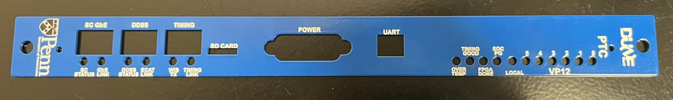

Acceptance: PASS/FAIL.

### A2. Bare PCB visual inspection

1. Count received PCBs; compare to purchase order.
2. Review vendor quality certificates and fill the designated **[GoogleDoc / inspection spreadsheet](https://docs.google.com/spreadsheets/d/10I7u4FrWQXx4R3NOPhapa5DsjlLhDk9keJTLW0Wgq5A/edit?gid=0#gid=0)**.
3. For sample PCBs:
   - inspect under microscope
   - compare against reference PCB
   - record notes for defects
4. Export completed form from [GoogleDoc](https://docs.google.com/spreadsheets/d/10I7u4FrWQXx4R3NOPhapa5DsjlLhDk9keJTLW0Wgq5A/edit?gid=0#gid=0) as:
   - Excel file
   - PDF file
5. Upload both files plus certificate/report copies to HWDB.
6. Label sample board sticker with:
   - PCB serial number
   - production batch
   - inspection date
   - inspector name
7. Segregate failed samples into `Rejected bare PCBs` and report.

**Example bare PCB (reference):**

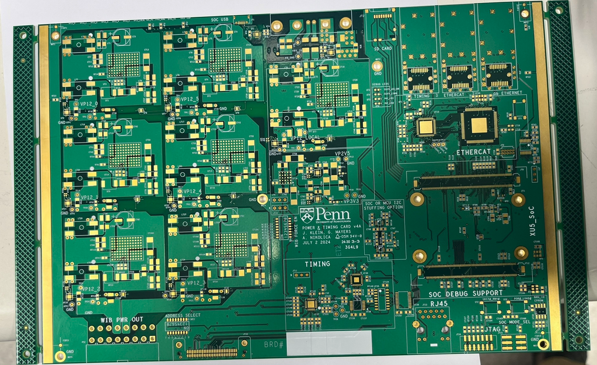

Acceptance: PASS/FAIL.

### A3. Assembled PCB visual inspection

1. Count boards.
2. Review certificates and complete the **[GoogleDoc / inspection spreadsheet](https://docs.google.com/spreadsheets/d/10I7u4FrWQXx4R3NOPhapa5DsjlLhDk9keJTLW0Wgq5A/edit?gid=0#gid=0)**.
3. For each assembled board:
   - take high-resolution photos (front and back)
   - microscope inspection checklist:
     - missing solder joints
     - solder bridges
     - wrong/missing parts
     - contamination
     - wrong part orientation
4. For any defect:
   - write defect note
   - take close-up photo
   - tag board `Visual Inspection Failed`
   - move to `Rejected Assembled PCBs` box
5. Scan serial into HWDB for every board (pass or fail).
6. Export completed forms from [GoogleDoc](https://docs.google.com/spreadsheets/d/10I7u4FrWQXx4R3NOPhapa5DsjlLhDk9keJTLW0Wgq5A/edit?gid=0#gid=0) as Excel + PDF, then upload both files to HWDB.

**Example assembled PCB (reference):**

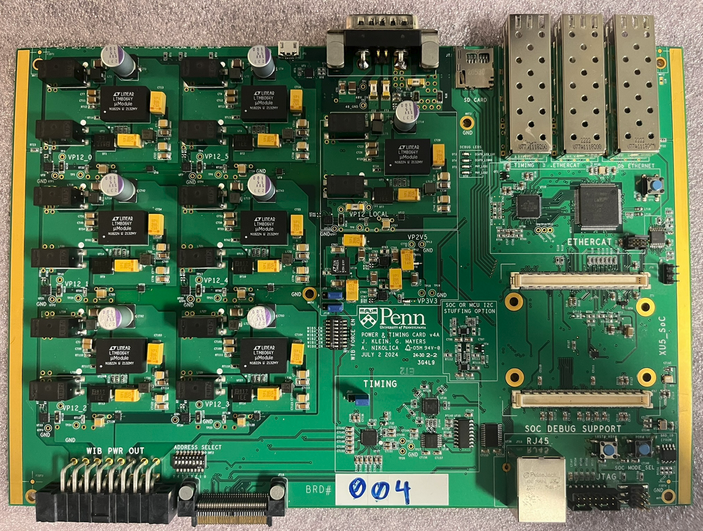

Acceptance: PASS/FAIL.

---

## 7) Phase B - QC Test Stand Preparation

> Tip for new users: this section includes Linux commands. Run them exactly as shown.

### B1. DUNE-DAQ setup (Linux)

Official documentation (same as the v1.1 PDF): **[DUNE-DAQ software documentation](https://dune-daq-sw.readthedocs.io/en/latest/)** and **[DAQ build tools (installation guide)](https://dune-daq-sw.readthedocs.io/en/latest/packages/daq-buildtools/)**.

#### One-time setup

```bash
cd <your-setup-directory>
source /cvmfs/dunedaq.opensciencegrid.org/setup_dunedaq.sh
setup_dbt dunedaq-v3.1.1
dbt-create -c -n N22-11-08 dune-daq-timing-dcsk
cd dune-daq-timing-dcsk/sourcecode
git clone https://github.com/DUNE-DAQ/timing.git
cd timing
git checkout tags/"nocdr_integration/b0"
cd ../../
```

#### Every reboot

```bash
cd <your-setup-directory>/dune-daq-timing-dcsk
source /cvmfs/dunedaq.opensciencegrid.org/setup_dunedaq.sh
setup_dbt dunedaq-v3.1.1
source dbt-env.sh
dbt-workarea-env
dbt-build
```

### B2. Create `local.xml` (one time)

Create file `local.xml` in `dune-daq-timing-dcsk` with:

```xml
<?xml version="1.0" encoding="UTF-8"?>
<connections>
  <connection id="MST_FMC" uri="ipbusudp-2.0://192.168.200.16:50001"
    address_table="file://sourcecode/timing/config/etc/addrtab/v7xx/master_fmc/top.xml" />
  <connection id="EPT_0" uri="ipbusudp-2.0://192.168.200.16:50001"
    address_table="file://sourcecode/timing/config/etc/addrtab/v7xx/endpoint_fmc/top.xml" />
</connections>
```

### B3. Timing master setup

1. Download the specified `.tgz` timing package (same link as the PDF): **[download firmware archive (.tgz)](https://pdts-fw.web.cern.ch/pdts-fw/index.php?p=tags%2Fnocdr_integration%2Fb0%2Fpipeline4286375&view=ouroboros_pc053d_nocdr-integration-b0_sha-01d4e48e_runner-slu9p8x4-project-19909-concurrent-1_220727_1123.tgz)**.
2. Extract it fully.
3. In Vivado Hardware Manager:
   - auto-connect JTAG
   - select FPGA
   - program using the extracted `.bit` file
4. Connect serial with minicom (19200, 8N1, no flow control).
5. At minicom prompt:
   - type `write` then Enter
   - enter `0xc0a8c810` then Enter (sets IP to `192.168.200.16`)
6. Confirm network reachability:

```bash
ping 192.168.200.16
```

7. Start timing output on Linux machine:

```bash
dtsbutler -c local.xml io MST_FMC reset
dtsbutler -c local.xml mst MST_FMC synctime
dtsbutler -c local.xml io EPT_0 reset
dtsbutler -c local.xml mst MST_FMC control-timestamp-broadcast
```

### B4. Prepare DUT hardware

**Test stand layout (reference photos from the official v1.1 procedure):**

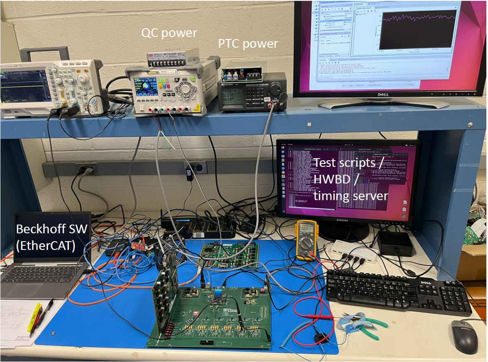

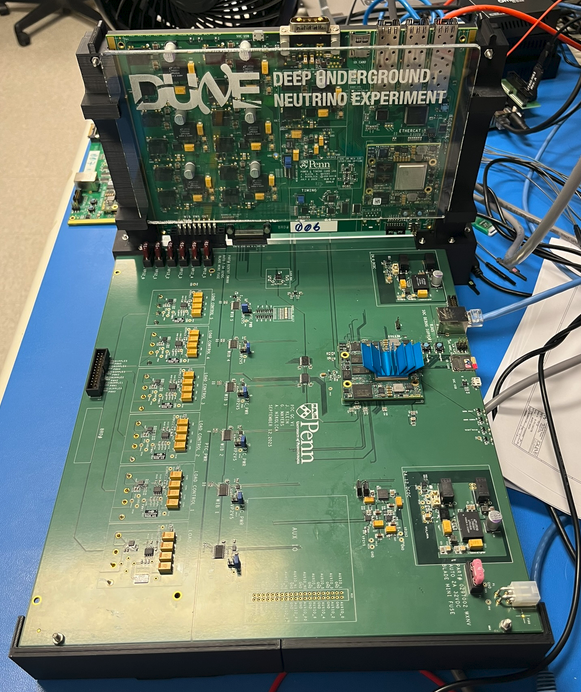

1. Ensure all required cables are connected with power OFF.
2. Insert DUT into QC board guide rails and seat connectors evenly.
3. Power on QC board (24V supply):
   - expected current about 400 mA
   - Enclustra amber LED should blink after a few seconds
4. Confirm QC board network comes up at `192.168.200.12`.
5. Optional test:

```bash
ping 192.168.200.12
ssh root@192.168.200.12
exit
```

6. Turn on QC heatsink fans (12V channel).

### B5. Prepare bootable SD card for DUT

1. Create partitions:
   - `BOOT` FAT32, 256 MB
   - `ROOT` EXT4, remainder
2. Copy to `BOOT`: `BOOT.bin`, `image.ub`, `boot.scr`
3. Copy `rootfs.tar.gz` to `ROOT`, then extract it there.
4. Insert SD card into DUT (do not force).

### B6. Install jumpers and scan serial

Set jumpers:
- `JT11` -> position 2-3
- `JT9` -> position 2-3
- `JT10` -> position 2-3
- all other 2/3-position headers -> no jumper

Remove protective film from `SWT1` and `SWT2`.

Scan DUT serial number into HWDB.

Acceptance: PASS/FAIL with serial logged.

---

## 8) Phase C - Manual QC Tests

### C1. Power-up test (no SoM)

1. Turn on 48V supply.
2. Confirm DUT current is **less than 100 mA**.
3. Measure `VP12 LOCAL` with DVM: **12.00 to 12.35 V**.
4. Confirm front LED `12V LOCAL` is ON.

Acceptance:
- current <= 100 mA
- voltage in range
- LED PASS/FAIL

### C2. DC-DC converter checks

For each of the 6 converters:
1. Set `SWT1` for that converter.
2. Measure corresponding `RIPPLE x` test point: **12.00 to 12.35 V**.
3. Scope setup:
   - AC coupling
   - 20 mV/div
   - 2 us/div
4. Confirm switching period **1.0 to 1.1 us** (about 917 kHz to 1 MHz).

**Example switching waveform on the scope (reference):**

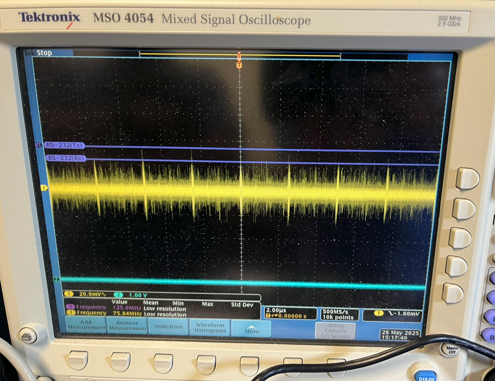

5. Confirm matching `WIB x` front LED is ON.

After all converters:
- set all DIP switches OFF
- power off DUT
- disconnect cables
- remove DUT safely
- reinstall clear QC plate

### C3. SoM tests

1. Scan SoM QR and log serial in HWDB.
2. Insert SoM carefully with correct orientation.
3. Reinstall DUT in QC stand.

Boot checks:
1. Turn on 48V.
2. Expected startup current about 100-200 mA initially.
3. Enclustra amber LED should blink.
4. Front panel LEDs that must be ON:
   - `12V LOCAL`
   - `PG`
   - `FPGA DONE`
5. Confirm serial access (115200, 8N1, login `root`).

Repeat boot reliability:
- run `init 0`
- wait for shutdown completion
- power off 60 seconds
- power on again
- repeat total of 5 boot cycles

Acceptance: PASS/FAIL.

---

## 9) Phase D - Semi-Automated QC Tests

### D1. DC-DC load test

1. Boot DUT while connected to powered QC board.
2. On DUT, enable converter 0:

```bash
python3 power_on_wib.py 0 on
```

3. On QC board, set PWM:

```bash
poke 0x80020038 0x316
poke 0x80020038 0x216
```

4. Confirm expected load current (on 48V supply, equivalent to DUT side load):
- ~1.5 A (+/-100 mA) at 25%
- ~3.0 A (+/-100 mA) at 50%
- ~4.5 A (+/-100 mA) at 75%
- ~6.0 A (+/-100 mA) near full load

5. At highest load, measure ripple at `RIPPLE 0`:
- scope 200 mV/div, 200 ns/div, AC coupling
- acceptance: within +/-200 mV

**Example ripple measurement (reference):**

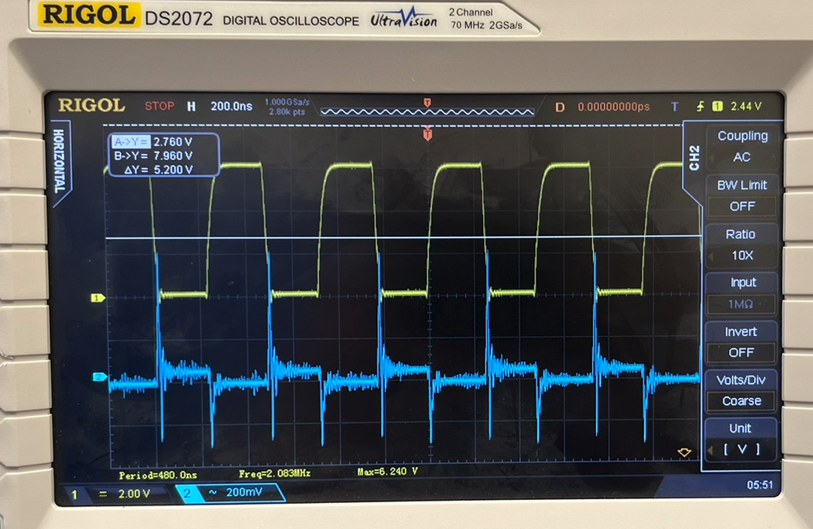

6. Repeat for converters 1-5 using their respective addresses.

### D2. I2C sensor tests

1. On DUT, enable all 6 converters.
2. Run sensor + EtherCAT test script with logfile name:

```bash
python3 ecat_test_1b.py <logfile-name>.txt
```

3. Record outputs in HWDB (manual entry or parser process when available).

**Example script output (reference):**

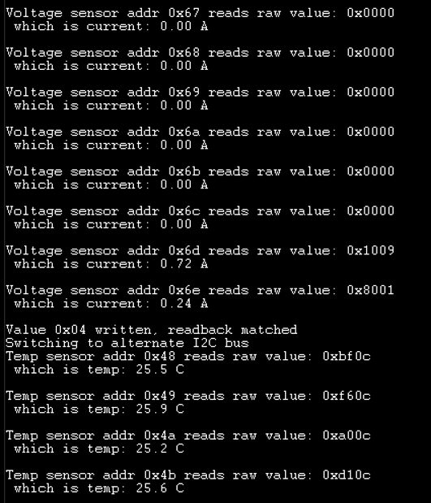

Acceptance ranges:
- main 12V outputs: 12.00 to 12.35 V
- converter current (25% load): 1.5 A +/-100 mA
- SoM current: <= 2 A
- 2.5V rail: 2.4 to 2.6 V
- 3.3V rail: 3.2 to 3.4 V
- local rail currents: <= 2 A
- 8 temperature sensors: ambient +/-5 C

Extended checks:
- run alert assertion script
- verify front `OVER TEMP` LED turns RED when alert asserted

Acceptance: PASS/FAIL.

### D3. Addressing tests

1. Remove clear QC plate.
2. Toggle each of 8 crate address DIP switches ON one at a time.
3. Confirm corresponding address indicator LED.
4. Reinstall clear plate.
5. Run EEPROM script and log unique serial ID.

Acceptance: PASS/FAIL with serial logged.

### D4. Microcontroller tests

1. Confirm required tools are installed on Windows:
   - TwinCAT3
   - DAVE (v4.1.4 or higher)
   - SSC tool (v5.12)
2. Copy ESI XML to:
   `C:\TwinCAT\3.1\Config\Io\EtherCAT`
3. Connect EtherCAT fiber path.
4. Program MCU:
   - JTAG programming via DAVE Debug
   - in-situ programming via FPGA (`openocd ...`)
5. In TwinCAT:
   - select correct adapter
   - scan
   - confirm configuration matched
   - go Online
   - enable Free-Run
   - verify no lost frames and stable counters

Check LEDs:
- front `LINK` LED
- front `ECAT RUN` LED
- debug LED states as specified

Acceptance: PASS/FAIL.

### D5. Timing tests

Run DUT timing lock sequence:

```bash
python3 setup_timing.py
poke 0x80020004 0x00010400
peek 0x80020104
poke 0x80020004 0x00010000
peek 0x80020104
```

Confirm expected status and front LEDs (`LINK`, `RX`).

Round-trip timing check:

```bash
dtsbutler -c local.xml mst MST_FMC align measure-delay 0
dtsbutler -c local.xml mst MST_FMC align toggle-tx 0 --on
dtsbutler -c local.xml mst MST_FMC align toggle-tx 0 --off
```

Confirm RTT value is present and front `TX` LED responds.

Acceptance: PASS/FAIL.

### D6. Ethernet tests

1. Confirm front `LINK` LED ON.
2. Ping DUT at `192.168.200.10` from Linux machine:

```bash
ping 192.168.200.10
```

3. SSH to DUT:

```bash
ssh root@192.168.200.10
```

4. Run throughput test according to project method (target >12.5 MB/s).
5. Verify AUX LED toggle method if register control is defined.

Acceptance: PASS/FAIL.

---

## 10) Phase E - Mechanical Install and Packing

### E1. Heatsink install

1. Clean top of each LTM-8064 with alcohol swab.
2. Apply TIM adhesive side 1 to converter.
3. Remove adhesive side 2 and apply heatsink with even pressure.

**Example with heatsinks installed (reference):**

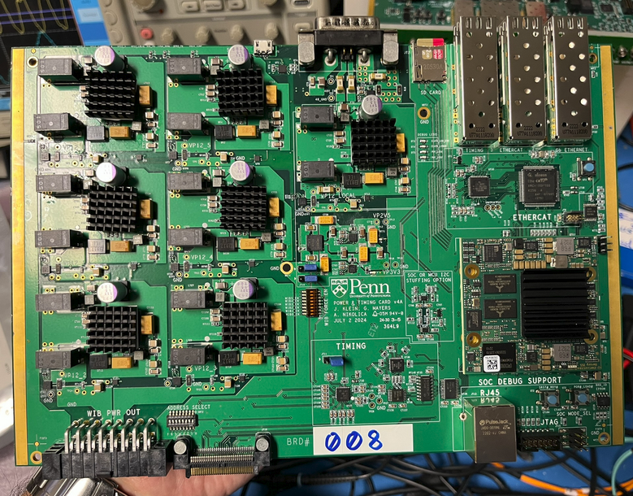

### E2. Front panel install

1. Insert light pipes and secure with rubber grommets.
2. Attach front panel at both L-bracket locations.

**Example with front panel installed (reference):**

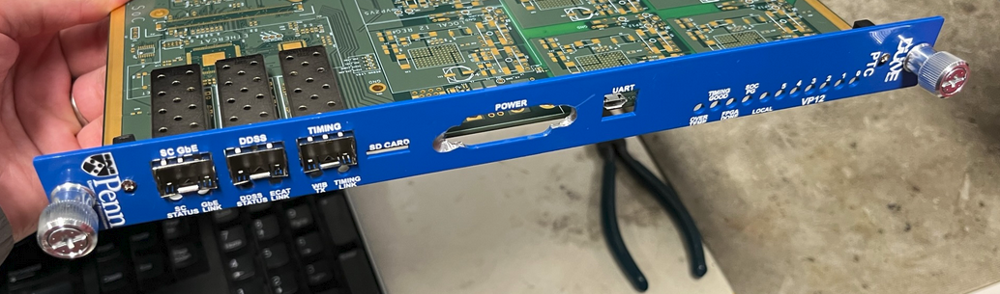

### E3. Pack for shipment

1. Place tested board in ESD bag.
2. Store in secure shipment staging area.
3. Confirm final DUT test result entered in HWDB.

Acceptance: PASS/FAIL.

### E4. WEIC sample test (reference only)

A subsample of fully tested PTCs may be installed in a warm electronics interface crate (WEIC) for further testing per lab procedures. **Example installation:**

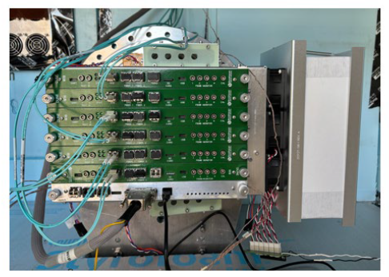

---

## 11) End-of-Shift Shutdown

1. Remove any DUT still installed.
2. On QC board, run:

```bash
init 0
```

3. Wait for shutdown-complete message.
4. Power off 24V QC board supply.
5. Power off 12V fan supply.
6. Complete shift log:
   - date/time
   - tester name
   - tested PTC serial numbers
   - result (PASS/FAIL/other)
   - comments/notes

---

## 12) Troubleshooting for Beginners

### Board does not respond to ping

1. Check cable seating on both ends.
2. Confirm board is powered and LEDs indicate boot.
3. Confirm IP address is correct for the target board.
4. Try ping again:

```bash
ping <ip-address>
```

5. If still failing, use serial console to verify board boot status.

### SSH connection fails

1. Confirm ping works first.
2. Use correct username:

```bash
ssh root@<ip-address>
```

3. If refused or timeout, verify service has started and board finished booting.

### Serial terminal not showing output

1. Recheck baud and 8N1 settings.
2. Confirm correct `/dev/ttyUSBx` device.
3. Unplug/replug USB cable and reconnect terminal.

### Current or voltage out of range

1. Stop test for that DUT.
2. Recheck jumper settings and DIP states.
3. Recheck probe location.
4. If still out of range, mark FAIL and escalate to engineer.

---

## 13) Required Records in HWDB

For each DUT, make sure these are saved:
- DUT serial number
- SoM serial number (if applicable)
- visual inspection results (pass/fail and notes)
- photos (front/back, plus any defect close-ups)
- script logs or parsed outputs
- final overall result (PASS/FAIL)

---

## 14) Final Notes

- Follow steps in order.
- Do not skip acceptance checks.
- If uncertain at any step, pause and ask for help before continuing.

This beginner version is intentionally explicit so first-time users can run the procedure consistently and safely.
